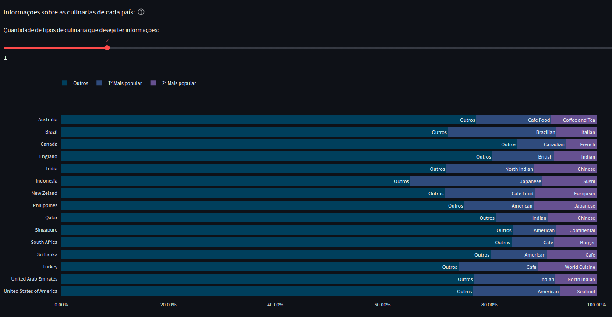

# 1.0 - PROJETO: ANALISANDO DADOS COM PYTHON

Como proposta de projeto para exercitar conceitos de progamação em Python e Análise de Dados estudados na Comunidade Data Science, foi proposto um
projeto utilizando dados públicos do Marketplace Zomato, disponivel no site [Kaggle](https://www.kaggle.com/datasets/shrutimehta/zomato-restaurants-data).

## 1.1 Contexto:
A empresa Zomato é uma marketplace de restaurantes. Ou seja, seu core business é facilitar o encontro e negociações de clientes e restaurantes. 
Os restaurantes fazem o cadastro dentro da plataforma da Zomato, que disponibiliza informações como endereço, tipo de culinária servida, se possui
reservas, se faz entregas e também uma nota de avaliação dos serviços e produtos do restaurante, dentre outras informações.

## 1.2 Desafio: 
O CEO Guerra (fictício) foi recém contratado e precisa entender melhor o negócio para conseguir tomar as melhores decisões estratégicas e alavancar
ainda mais a Zomato, e para isso, ele precisa que seja feita uma análise nos dados da empresa e que sejam gerados dashboards, a partir dessas análises,
para responder às seguintes perguntas:

<strong> 1.2.1 - Perguntas Gerais</strong> 

  - Quantos restaurantes únicos estão registrados?

  - Quantos países únicos estão registrados?

  - Quantas cidades únicas estão registradas?

  - Qual o total de avaliações feitas?

  - Qual o total de tipos de culinária registrados?
  

 

<strong> 1.2.2 - Perguntas por País</strong> 

  
  - Qual o nome do país que possui mais cidades registradas?

  - Qual o nome do país que possui mais restaurantes registrados?

  - Qual o nome do país que possui mais restaurantes com o nível de preço igual a 4 registrados?

  - Qual o nome do país que possui a maior quantidade de tipos de culinária distintos?

  - Qual o nome do país que possui a maior quantidade de avaliações feitas?

  - Qual o nome do país que possui a maior quantidade de restaurantes que fazem entrega?

  - Qual o nome do país que possui a maior quantidade de restaurantes que aceitam reservas?

  - Qual o nome do país que possui, na média, a maior quantidade de avaliações registrada?

  - Qual o nome do país que possui, na média, a maior nota média registrada?

  - Qual o nome do país que possui, na média, a menor nota média registrada?

  - Qual a média de preço de um prato para dois por país?
  

   

<strong> 1.2.3 - Perguntas por Cidade</strong> 

  - Qual o nome da cidade que possui mais restaurantes registrados?

  - Qual o nome da cidade que possui mais restaurantes com nota média acima de

  - Qual o nome da cidade que possui o maior valor médio de um prato para dois?

  - Qual o nome da cidade que possui mais restaurantes com nota média abaixo de 2.5?

  - Qual o nome da cidade que possui o maior valor médio de um prato para dois?

  - Qual o nome da cidade que possui a maior quantidade de tipos de culinária distintas?

  - Qual o nome da cidade que possui a maior quantidade de restaurantes que fazem reservas?

  - Qual o nome da cidade que possui a maior quantidade de restaurantes que fazem entregas?

  - Qual o nome da cidade que possui a maior quantidade de restaurantes que aceitam pedidos online?

  

<strong> 1.2.4 - Perguntas por Restaurantes</strong> 

  - Qual o nome do restaurante que possui a maior quantidade de avaliações?

  - Qual o nome do restaurante com a maior nota média?

  - Qual o nome do restaurante que possui o maior valor de uma prato para duas pessoas?

  - Qual o nome do restaurante de tipo de culinária brasileira que possui a menor média de avaliação?

  - Qual o nome do restaurante de tipo de culinária brasileira, e que é do Brasil, que possui a maior média de avaliação?

  - Os restaurantes que aceitam pedido online são também, na média, os restaurantes que mais possuem avaliações registradas?

  - Os restaurantes que fazem reservas são também, na média, os restaurantes que possuem o maior valor médio de um prato para duas pessoas?

  - Os restaurantes do tipo de culinária japonesa dos Estados Unidos da América possuem um valor médio de prato para duas pessoas maior que as churrascarias americanas (BBQ)?

  

<strong> 1.2.5 - Perguntas por Culinária</strong> 

  - Dos restaurantes que possuem o tipo de culinária italiana, qual o nome do restaurante com a maior média de avaliação?

  - Dos restaurantes que possuem o tipo de culinária italiana, qual o nome do restaurante com a menor média de avaliação?

  - Dos restaurantes que possuem o tipo de culinária americana, qual o nome do restaurante com a maior média de avaliação?

  - Dos restaurantes que possuem o tipo de culinária americana, qual o nome do restaurante com a menor média de avaliação?

  - Dos restaurantes que possuem o tipo de culinária árabe, qual o nome do restaurante com a maior média de avaliação?

  - Dos restaurantes que possuem o tipo de culinária árabe, qual o nome do restaurante com a menor média de avaliação?

  - Dos restaurantes que possuem o tipo de culinária japonesa, qual o nome do restaurante com a maior média de avaliação?

  - Dos restaurantes que possuem o tipo de culinária japonesa, qual o nome do restaurante com a menor média de avaliação?

  - Dos restaurantes que possuem o tipo de culinária caseira, qual o nome do restaurante com a maior média de avaliação?

  - Dos restaurantes que possuem o tipo de culinária caseira, qual o nome do restaurante com a menor média de avaliação?

  - Qual o tipo de culinária que possui o maior valor médio de um prato para duas pessoas?

  - Qual o tipo de culinária que possui a maior nota média?

  - Qual o tipo de culinária que possui mais restaurantes que aceitam pedidos online e fazem entregas? 

  

# 2.0 - Premissas assumidas para a análise:

**2.1** - O modelo de negócio foi assumido como um Marketplace;

**2.2** - A última atualização do dataset foi no dia 13/03/2018. Essa foi a data considerada para realizar as conversões dos preços dos pratos
dos restaurantes, que foram fornecidas na moeda local do país onde o restaurante pertence, para dolar;

**2.3** - As principais visões de negócio foram: Visão Geral (mundial), País e Cidade;

**2.4** - Restaurantes com zero avaliações e/ou com preço de prato para dois igual a zero foram desconsiderados da análise.

# 3.0 - Estratégia de solução:

O paínel estratégico foi desenvolvido utilizando as métricas que refletem as três principais visões do modelo de negócio da empresa: Geral, por País e por Cidade. A ideia é
criar um Dashboard que afunila essas informações onde nas métricas gerais temos um apanhado de informações do négocio como um todo e informações breve sobre todos os países; 
na visão por País seleciona-se o país de interesse e obtem-se informações dos restaurantes cadastrados nesse país e informações sobre as cidades desse país; já em visão por
cidade temos as informações gerais da cidade selecionada e de métricas de restaurantes por bairros dessa cidade. O conjunto de métricas em cada tipo de visão está listado abaixo:

<strong> 3.1 - Visão Geral</strong> 

  
  - Quantidade de restaurantes registrados;
  
  - Quantidade de paises registrados;
  
  - Quantidade de cidades registradas;
  
  - Total de avaliações feitas na plataforma;
  
  - Gráfico borboleta comparando o número de cidades cadastradas e quantidade de restaurantes registrados em cada país;
  
  - Tabela que informa a média de preço para dois, avaliação média e número de avaliações dos restaurantes em cada país;
  
  - Um gráfico de barras empilhadas que mostra o percentual dos tipos de culinaria mais populares em cada país.
  

  
  

<strong> 3.2 - Visão por País</strong> 

  
  - Total de cidades cadastradas no país;
  
  - Média de avaliação dos restaurantes no país;
  
  - Custo médio de uma refeição para dois no país;
  
  - Gráfico de barras empilhadas indicando a quantidade de restaurantes por cidade no país. A pilha de barras pode ser feita comparando os restaurantes
  que entregam, reservam ou aceitam pedidos online, sendo essa uma opção para o usuário;
  
  - Gráfico de barras que mostra a nota média dos restaurantes por cidade do país, comparando entre os restaurantes que entregam, reservam ou aceitam pedidos online;
  
  - Gráfico de barras que indica as culinarias mais populares no país;
  

   

<strong> 3.3 - Visão por Cidade</strong> 

  
  - Quantidade de restaurantes cadastrados na cidade selecionada;
  
  - Média das avaliações dos restaurantes na cidade;
  
  - Custo médio de um prato para dois na cidade;
  
  - Gráfico borboleta comparando o preço médio para dois e a quantidade de restaurantes por bairro da cidade selecionada;
  
  - Gráfico de barras das culinárias mais populares na cidade;
  
  - Tabela contendo a(s) culinária(s); preço médio para dois; se reservam, entregam, aceitam pedidos online; avaliação e quantidade de avaliações dos restaurantes da cidade.
  

  

# 4.0 - Principais insights de dados:
  
  - Em geral, a quantidade de cidadades cadastradas por país é proporcional ao número de restaurantes cadastrados, porém a África do Sul e Filipinas fogem desse padrão, indicando
  uma baixa densidade de restaurantes cadastrados (número de restaurantes/número de cidades). Portanto pode ser interessante campanhas da empresa nas cidades desse país para aumentar
  o número de restaurantes cadastrados;
  
  - A Índia é o único país com quantidade significativa de restaurantes que não oferecem serviços de entrega, reserva e pedidos online, provavelmente pelo trânsito caótico que existe
  na maioria das cidades indianas. Isso pode ser um dos fatores da Índia possuir o menor valor de prato para dois e ter a segunda pior avaliação média1 4.0. Entretanto, as cidades Gangtok
  e Shimla, que oferecem esses serviços em todos seus restaurantes, possuem avaliações menores que a média do país (1.7 e 3.3, respectivamente);

  - Os EUA é o país com mais restaurantes cadastrados com notas acima de 4.5, superando a Índia, que possui 545.

# 5.0 - Produto final do projeto:

O arquivo "JN_Zomato.ipynb", presente nesse repositório, é um JupyterNotebook que contém todas as questões apresentadas na seção 1.2. Além disso foi desenvolvido um 
dashboard interativo, como comentado na seção 3.0, ele pode ser acessado clicando [aqui](https://mr-zomato-restaurants.streamlit.app).

Ao acessar a página o usuário vê a página Home, onde ele tem informações gerais do dashboard e um menu lateral onde ele pode alterar entre as visões geral, país e cidade, como mostrado na figura: 

Ao alternar entre as abas o usuário pode filtrar restaurantes por nota e faixa de preço. Outras seleções estão disponíveis no menu a depender de qual aba o usuário se encontra: em Geral é possível selecionar os países para comparação, por padrão todos países são selecionados; na aba País apenas um país pode ser escolhido e surge uma opção de seleção de cidades, que por padrão é escolhido todas cidades do país; por fim, na aba cidade o usuário pode escolhes apenas um país e uma cidade pertencente a esse país. A figura abaixo mostra uma visualização dessas opções: .

Existem outros filtros específicos para determinados gráficos dentro das páginas, em Geral podemos selecionar a quantidade de culinarias que são mostradas por país, como ilustrado na imagem a seguir: .

Na página País é possível fazer comparações com base nos serviços oferecidos, como mostrado abaixo: 

E na página Cidades, o usuário consegue filtrar os bairros da cidade escolhida.
  
# 6.0 - Conclusões:

O objetivo do projeto foi concluído, foi criado um jupyter notebook que contém todas respostas solicitadas e também foi criado um dashboard que reúne as principais informações do negócio. Isso possibilita que o time de negócio tenha acesso de forma rápida e acessível as informações relevantes para tomadas de decisões.

# 7.0 - Próximos passos

  - Implementar novas visões de negócio, como por exemplo um estudo mais detalhado das culinárias por restaurantes;

  - Reduzir o número de métricas;

  - Agrupar os tipos de culinárias e bairros que são redundantes;
  
  - Criar novos filtros
